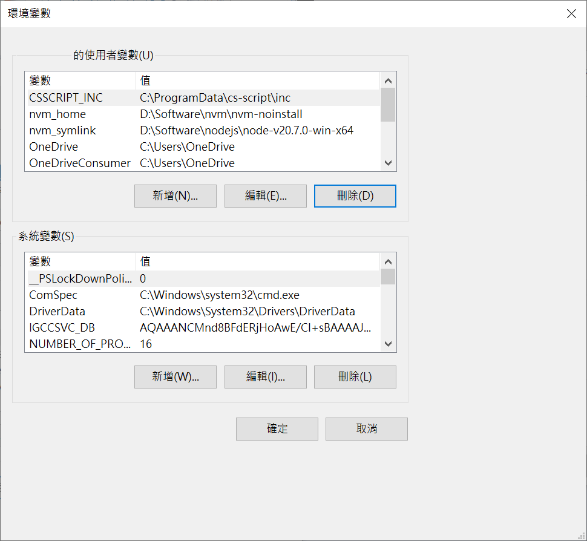

title: Spring Boot 快速啟動
date: 2023-09-28 05:06
categories: Java
---

介紹如何安裝Java和Maven,並透過Spring.IO產生專案,並經由Maven啟動Web服務

# 下載及設定 Java

## 下載 JAVA

開啟 [OpenJDK官網](https://openjdk.org/), 
往下移動

至 `Download and install the latest open-source JDK.`,點擊 ` jdk.java.net/21`.

頁面跳轉至 `jdk.java.net/21` 


根據運行的作業系統選擇對應的檔案,在此以 `Windows/x64` 為範例, 保存檔案`openjdk-21_windows-x64_bin.zip`

## 設定 JAVA_HOME 環境變數

下載`openjdk-21_windows-x64_bin.zip`檔案後,將其解壓縮. 

開啟 `控制台` 

, 

點擊 `系統`, 移動並點擊 `進階系統設定`


點擊 `環境變數`,


使用者變數 點擊 `新增`



新增使用者變數


`變數名稱` 輸入 `JAVA_HOME`

`變數值` 輸入 `D:\Software\openjdk-20+36_windows-x64_bin\jdk-20`


移動至 `Path`, 點擊 `編輯`


 


新增 `%JAVA_HOME%\bin` 和 `%JAVA_HOME%\jre\bin`

# 下載及設定 Maven

## 下載 Maven

## 設定 Maven

# 從Spring.IO 產生專案

https://start.spring.io/

## Dependencies 選擇 `Web`

# 運行 

``` bash
mvn spring-boot:run
```


